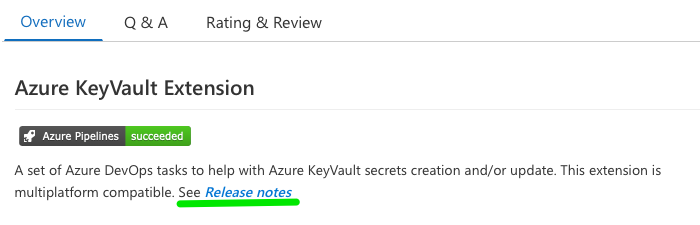

## Related Issues

- ### [Issue0016](https://github.com/expertasolutions/AzureKeyVaultExtension/issues/16)

  - Add the Release notes support for GitHub release to the VisualStudio Marketplace page

    

- ### [Issue0013](https://github.com/expertasolutions/AzureKeyVaultExtension/issues/13)

  - When invalid Azure KeyVault is set, the execution of the task fail.