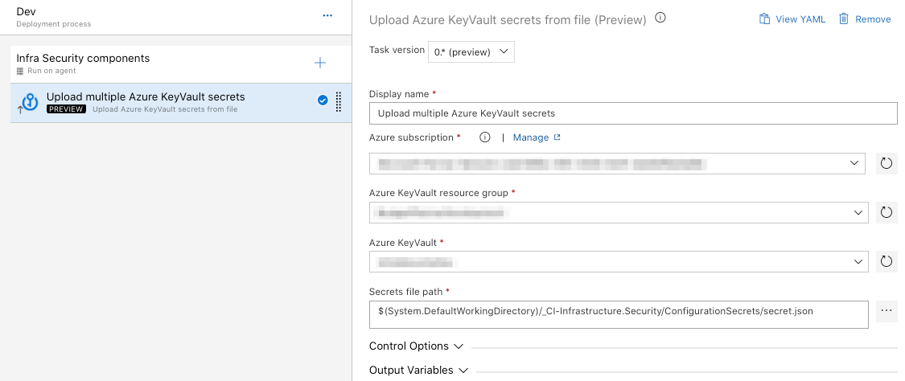
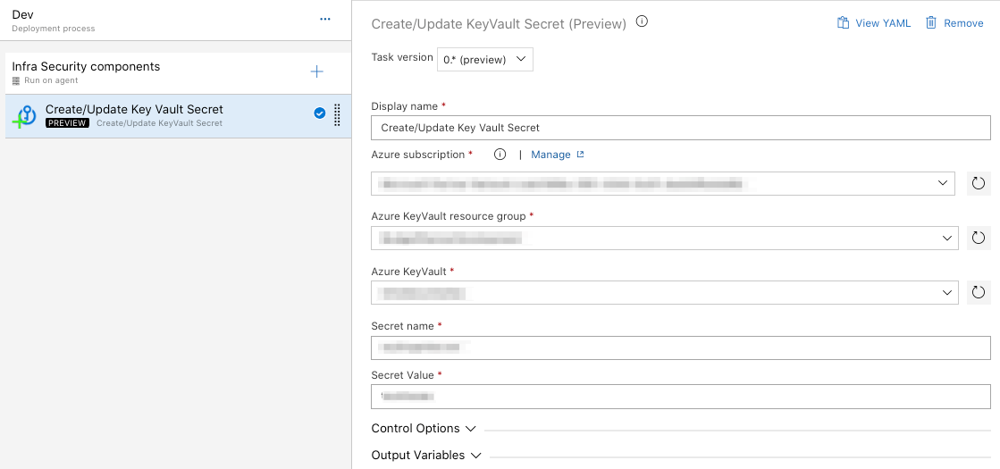

# Azure KeyVault Extension
A set of Azure DevOps tasks to help with Azure KeyVault secrets creation and/or update.


# Tasks
## ManageKeyVaultSecrets

#### Secrets file path (expected file format content)
```json
[
	{
		"secret": "my_first_secret",
		"value": "my_first_secret_value"
	},
	{
		"secret": "my_second_secret",
		"value": "my_second_secret_value"
	}
]
```
#### Important
*** Ensure that your subscription service principal have proper access policies rights on your Azure Key Vault ***

## ManageKeyVaultSingleSecret

#### Important
*** Ensure that your subscription service principal have proper access policies rights on your Azure Key Vault ***